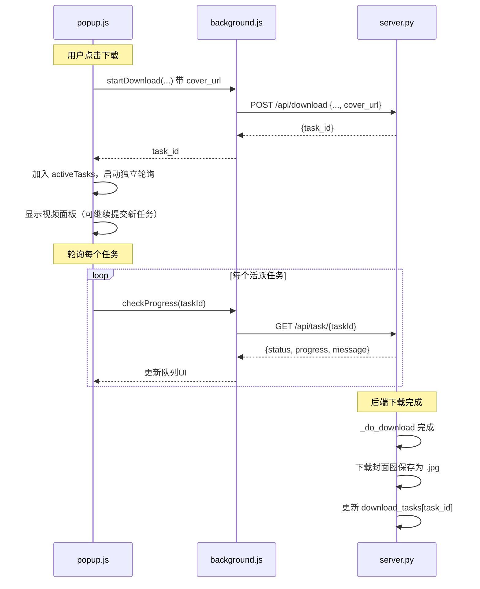

## 用户需求

为现有 B站视频下载插件增加两个核心功能：封面下载和下载队列。

## 产品概述

在现有下载功能基础上，下载视频时自动保存 B站原始封面图为同名 .jpg 文件；同时将单一任务进度面板改造为多任务队列面板，用户可以连续提交多个下载任务，每个任务独立显示进度条和状态，不阻塞后续下载。

## 核心功能

- **封面下载**：视频下载完成后，后端自动使用 httpx 下载 B站原始封面图，保存为与视频文件同名的 .jpg 文件（例如 `视频标题_1080P 高清.mp4` 对应 `视频标题_1080P 高清.jpg`）
- **下载队列**：前端支持同时提交多个下载任务，每个任务拥有独立的轮询间隔和进度状态。进度面板从单一进度条改为任务列表形式，每个任务显示标题（截断）、独立进度条、百分比和状态图标
- **任务列表交互**：下载完成的队列项显示绿色完成标记和打开文件夹按钮，失败项显示红色错误信息，下载中的项显示实时进度
- **返回视频面板**：用户可随时返回视频信息页面提交新任务，不影响正在进行的下载任务

## 视觉设计

380px 宽度的弹窗内，队列项采用紧凑卡片设计：左侧状态图标 + 中间标题（单行截断）+ 进度条 + 右侧百分比。深色主题 (#1a1a2e)，B站粉 (#FB7299) 作为进度条主色。

## 技术栈

- 后端：Python FastAPI + httpx（沿用现有，不改架构）
- 前端：Vanilla JavaScript + Chrome Extension Manifest V3
- 数据流：popup.js → background.js → server.py → bilibili_api.py → B站 API

## 实现方案

### 核心策略：后端轻量改动 + 前端重构进度面板

**改动范围：1 个后端文件 + 3 个前端文件**，不改变现有消息传递架构，`asyncio.create_task` 天然支持后端并发。

#### 1. 封面下载（server.py）

在 `_do_download()` 函数的下载完成阶段（第520行附近），增加封面下载逻辑：

- 从 `/api/download` 请求体中读取可选的 `cover_url` 字段
- 视频下载完成后，若 `cover_url` 存在，使用 httpx 下载封面
- 保存路径与视频输出文件同名但后缀改为 `.jpg`
- 封面下载失败不影响主任务状态（仅日志记录）
- 下载封面复用现有的 `_download_file` 函数

#### 2. 下载队列（popup.js + popup.html + popup.css）

**前端架构变更**：

- `state` 新增 `activeTasks: []` 数组，每个任务对象包含 `{ taskId, title, intervalId, status, progress, message, filePath }`
- `startDownload()` 不再阻塞 UI：提交下载后立即返回视频面板，不隐藏视频面板
- `pollProgress()` 改为接收任务对象参数，独立轮询每个任务
- 进度面板 `#progress-panel` 改为任务列表容器，动态生成 `.queue-item` DOM 元素

**队列 UI 渲染**：

- 每次 `pollProgress` 触发时更新对应队列项的 DOM
- 完成的任务标记为绿色 `.queue-item.completed`，显示文件夹按钮
- 失败的任务标记为红色 `.queue-item.failed`，显示错误信息
- 已完成和失败的任务停止轮询，清除 interval

**HTML 结构变更**：

- `#progress-panel` 内部改为 `<div id="queue-list"></div>` + 底部返回按钮
- 移除单一进度条元素 `#progress-bar` `#progress-text` `#progress-percent`（改为队列项内部动态生成）
- 新增 `#queue-back-btn` 返回视频面板

**CSS 新增样式**：

- `.queue-list`：滚动容器，max-height 限制
- `.queue-item`：紧凑卡片，左侧状态图标 + 中间信息区 + 进度条 + 百分比
- `.queue-item.completed` / `.queue-item.failed` 状态样式
- 进度条复用现有渐变色

### 数据流



### 性能与兼容性

- **封面下载**：在视频下载完成后执行，不影响下载速度，单次 HTTP GET 开销 < 2s
- **队列轮询**：每个任务独立 setInterval，间隔 1s，单次 /api/task/{id} 响应 < 10ms（仅查内存 dict）
- **DOM 更新**：只更新变化的任务项 DOM，不整体重渲染
- **向后兼容**：cover_url 参数可选，不传时行为与现有一致；旧版前端也能正常工作

## 目录结构

```
G:\bilibili-downloader\
├── backend\
│   └── server.py              # [MODIFY] DownloadRequest 新增 cover_url 字段，_do_download() 下载完成后下载封面
└── extension\
    ├── popup.html             # [MODIFY] 进度面板改为队列列表结构，新增队列返回按钮
    ├── popup.js               # [MODIFY] 状态增加 activeTasks，下载不阻塞UI，多任务独立轮询
    └── popup.css              # [MODIFY] 新增队列项样式，移除单一进度条样式
```

## 关键代码结构

### server.py DownloadRequest 模型变更

```python
class DownloadRequest(BaseModel):
    bvid: str
    cid: int
    title: str
    quality: int
    cookie: str = ""
    download_path: str = ""
    download_mode: str = "video"
    audio_format: str = "mp3"
    download_danmaku: bool = False
    danmaku_mode: str = "soft"
    cover_url: str = ""  # [NEW] B站原始封面图URL
```

### server.py _do_download() 封面下载逻辑

```
# 在 task["status"] = "completed" 之后（约第521行）插入：
if req.cover_url:
    try:
        cover_path = output_path.with_suffix(".jpg")
        async with httpx.AsyncClient(timeout=30) as cover_client:
            await _download_file(cover_client, req.cover_url, cover_path, headers, task, 0, 0)
        task["cover_path"] = str(cover_path)
    except Exception as e:
        print(f"[WARN] 封面下载失败: {e}")
        # 不影响主任务
```

### popup.js 状态变更

```javascript
let state = {
    // ... 现有字段保持不变 ...
    activeTasks: [],      // [NEW] 活跃下载任务列表
    // 移除 currentTaskId, pollInterval, downloading (由 activeTasks 管理)
};
```

### popup.js 下载流程变更

```javascript
async function startDownload() {
    // ... 提交下载请求，获取 task_id ...
    const taskObj = { taskId, title, intervalId: null, status: 'preparing', progress: 0, message: '' };
    state.activeTasks.push(taskObj);
    taskObj.intervalId = setInterval(() => pollTaskProgress(taskObj), 1000);
    renderQueueList();       // 显示队列面板
    show(els.progressPanel);
    show(els.videoPanel);    // 同时显示视频面板，可继续下载
}

function pollTaskProgress(taskObj) {
    // 轮询 /api/task/{taskObj.taskId}
    // 更新 taskObj 的 progress/message/status
    // 更新对应 DOM 元素
    // 完成或失败时 clearInterval(taskObj.intervalId)
}

function renderQueueList() {
    // 遍历 state.activeTasks，为每个任务生成/更新 .queue-item DOM
    // 已完成任务显示绿色 + 文件夹按钮
    // 失败任务显示红色 + 错误信息
}
```

### popup.html 进度面板变更

```html
<div id="progress-panel" class="hidden">
    <div id="queue-list"></div>
    <button id="queue-back-btn" class="btn btn-secondary">返回视频页面</button>
</div>
```

### popup.css 队列样式

```css
.queue-list { max-height: 320px; overflow-y: auto; }
.queue-item { display: flex; align-items: center; gap: 8px; padding: 10px 12px; border-bottom: 1px solid #2a2a3e; }
.queue-item .q-status { font-size: 16px; flex-shrink: 0; }
.queue-item .q-info { flex: 1; min-width: 0; }
.queue-item .q-title { font-size: 12px; color: #ccc; white-space: nowrap; overflow: hidden; text-overflow: ellipsis; }
.queue-item .q-progress-bar { height: 4px; background: #2a2a3e; border-radius: 2px; margin-top: 4px; }
.queue-item .q-progress-fill { height: 100%; background: linear-gradient(90deg, #FB7299, #ff6b9d); border-radius: 2px; }
.queue-item .q-percent { font-size: 12px; font-weight: 600; color: #FB7299; flex-shrink: 0; }
.queue-item.completed .q-percent { color: #4caf50; }
.queue-item.failed .q-percent { color: #ff5252; }
```