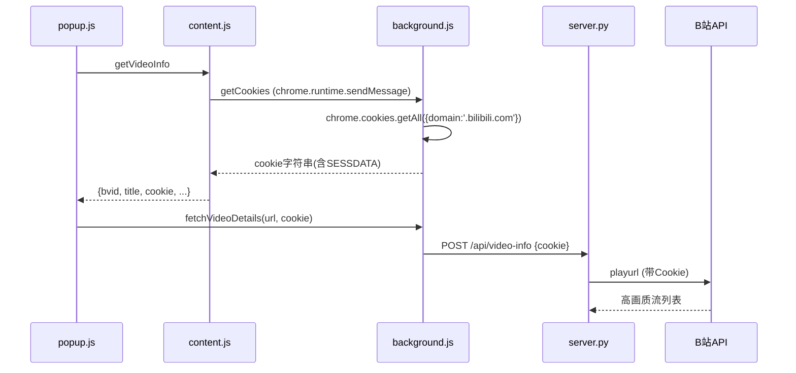

## 用户需求

修复B站下载插件无法获取高规格质量视频（4K、1080P等）的问题，使插件能正常下载包括4K、8K、杜比视界在内的所有画质。

## 产品概述

B站视频下载插件的核心能力增强——让已登录B站的用户能够下载其账号权限范围内的全部画质，包括需要大会员的高规格视频。

## 核心功能

- 修复Cookie获取：从`document.cookie`改为通过`chrome.cookies` API获取包含HttpOnly Cookie的完整登录态
- 补全画质排序：QUALITY_ORDER加入缺失的125(HDR真彩)和126(杜比视界)
- 画质标注：在画质下拉列表中为大会员专属画质添加"(大会员)"标签
- 登录态提示：在服务状态区显示Cookie获取状态，提示用户登录B站以解锁高画质

## 技术栈

- 前端：Chrome Extension (Manifest V3, HTML/CSS/JS)
- 后端：FastAPI + Python (bilibili_api模块)
- Cookie API：`chrome.cookies.getAll()` (Chrome Extension API)

## 实现方案

### 核心策略：修复Cookie获取链路

当前Cookie流向：

```
content.js(document.cookie) → popup.js → background.js → server.py → bilibili_api.py → B站API
```

问题：`document.cookie`只能获取非HttpOnly Cookie，关键的`SESSDATA`（登录凭证）是HttpOnly的，导致后端请求B站API时缺少有效登录态。

修复后Cookie流向：

```
content.js → background.js(chrome.cookies API) → content.js → popup.js → ... → B站API
```

### 技术决策

1. **为何在content.js中发起background请求而非在popup.js中**：content.js的`getVideoInfo`消息处理器本来就需要返回cookie，在此处改为异步获取最符合现有架构，改动范围最小。且content.js有`return true`支持异步sendResponse。

2. **为何使用`chrome.cookies.getAll`而非直接在background发起请求**：background.js通过`chrome.cookies`可获取包括HttpOnly在内的所有Cookie，域名过滤`.bilibili.com`精确匹配。

3. **QUALITY_ORDER补全**：125和126画质虽然已存在于QUALITY_MAP，但排序列表缺失，会导致流排序异常（`index()`抛出异常→fallback到999排最后）。

### 实现注意事项

- **异步响应兼容**：content.js的`onMessage`需要`return true`配合异步`sendResponse`，此模式已在使用中（第104行），只需将cookie获取改为异步
- **Cookie拼接格式**：`chrome.cookies`返回对象数组（含name、value等），需拼接为`name1=value1; name2=value2`的标准Cookie字符串
- **权限已就绪**：`manifest.json`第7行已声明`cookies`权限，无需修改manifest
- **画质标签仅影响UI**：大会员标签只是视觉提示，不影响实际下载逻辑——后端已经正确传递参数（`fnval=4048`、`fourk=1`），能否下载取决于Cookie有效性

## 架构设计

### 数据流



### 修改文件清单

```
G:\bilibili-downloader\
├── extension/
│   ├── content.js      # [MODIFY] getVideoInfo改为异步，从background获取Cookie
│   ├── background.js    # [MODIFY] 新增getCookies消息处理器
│   └── popup.js         # [MODIFY] 画质列表添加大会员标注，服务状态增加登录提示
└── backend/
    └── bilibili_api.py  # [MODIFY] QUALITY_ORDER补全125和126
```

## 实现细节

### 1. background.js - 新增getCookies处理器

在现有`onMessage`监听器（第15行块）中新增处理分支。使用`chrome.cookies.getAll({domain: '.bilibili.com'})`获取所有Cookie（含HttpOnly），拼接为`name=value; name2=value2`字符串返回。同时增加`checkLoginStatus`处理器，判断是否存在SESSDATA。

### 2. content.js - getVideoInfo改为异步获取Cookie

第88-106行的`getVideoInfo`处理器中，将`const cookie = getAllCookies()`替换为异步调用：先`chrome.runtime.sendMessage({action:'getCookies'})`向background获取完整Cookie，在回调中构建响应对象并`sendResponse`。保留`return true`以支持异步响应模式。第52-54行的`getAllCookies`函数可保留作为fallback。

### 3. bilibili_api.py - 补全QUALITY_ORDER

第36行改为`QUALITY_ORDER = [127, 126, 125, 120, 116, 112, 80, 74, 64, 32, 16, 6]`，在127(8K)后面加入126(杜比视界)和125(HDR真彩)。

### 4. popup.js - 画质标注与登录提示

在第232-238行的画质选项生成逻辑中，对112、116、120、125、126、127添加"(大会员)"后缀。在`checkServerStatus`函数中增加Cookie获取状态检测，提示用户登录B站以解锁高画质。

## 使用的扩展

### SubAgent

- **code-explorer**
- 用途：探索项目中content.js、background.js、bilibili_api.py的现有代码结构和消息传递机制
- 预期结果：确认所有需要修改的确切行号和上下文，确保修改精准无误