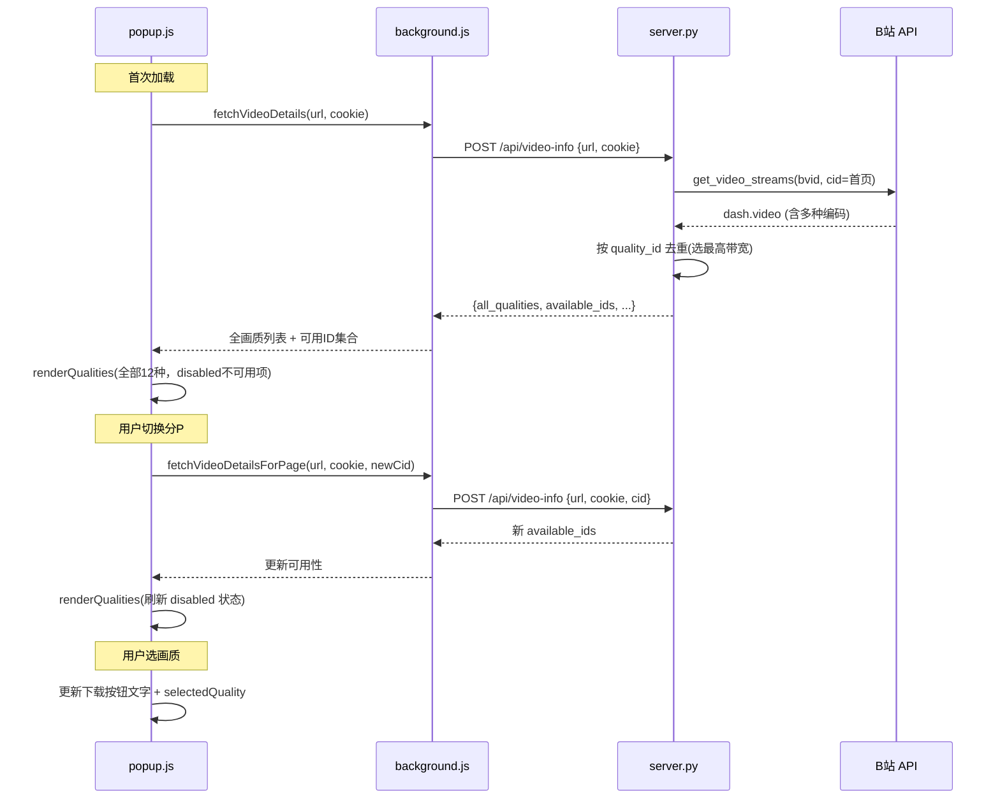

## 用户需求

优化 B站视频下载插件的画质选择体验，解决当前存在的三个核心问题并增强交互反馈。

## 产品概述

对现有 B站下载插件进行画质选择模块的全面升级。用户打开任意 B站视频页面后，插件弹出窗口将始终展示完整的 12 种画质层级（从 8K 到 240P），当前视频不可用的画质以灰色禁用态呈现并标注锁图标，让用户清晰了解画质层级和账号权限差距。多 P 视频切换分集时画质列表自动刷新。下载按钮实时显示当前选中的画质名称，用户点击前即可确认下载规格。

## 核心功能

- **画质去重**：同一画质 ID 下 B站返回多种编码（avc1/hev1/av01）只保留一条，优选高码率编码，下拉框不再出现重复条目
- **全画质展示**：下拉框始终展示 12 种完整画质（8K/杜比/HDR/4K/1080P60/1080P高码率/1080P/720P60/720P/480P/360P/240P），不可用的灰显禁用并标记锁图标
- **多 P 画质联动**：切换分 P 时自动向服务端请求该 P 的可用画质，下拉框即时刷新可用性
- **按钮画质提示**：下载按钮文字动态显示当前选中画质名称，如"下载 4K 超清"

## 技术栈

- 后端：Python FastAPI + httpx（沿用现有）
- 前端：Vanilla JavaScript（Chrome Extension Manifest V3，沿用现有）
- 数据流：popup.js -> background.js -> server.py -> bilibili_api.py -> B站 API

## 实现方案

### 核心策略：三层改动，最小侵入

**改动范围控制在 2 个后端文件 + 1 个前端文件**，不新增文件，不改变现有消息传递架构。

#### 1. 画质去重（server.py）

问题根因：B站 DASH API 对同一画质 ID（如 80=1080P）返回多条流，每条使用不同编码（avc1、hev1、av01）。`get_video_streams()` 和 `/api/video-info` 均原样透传，导致下拉框出现多条"1080P 高清"。

解决策略：在 `/api/video-info` 响应层按 `quality_id` 去重，同 ID 多条流中**优选带宽最高**的那条（带宽高 = 码率高 = 画质好）。`get_video_streams()` 函数保持不变，因为 `_do_download()` 直接调 B站 API 下载，不依赖此函数。

#### 2. 多 P 联动（server.py + popup.js）

当前问题：`/api/video-info` 固定用 `info["pages"][0]["cid"]` 获取画质，切换分 P 后画质不变。

解决方案：

- 后端：`/api/video-info` 新增可选 `cid` 参数，传入时使用指定 cid，不传时默认第一 P
- 前端：监听 `pageSelect` 的 `change` 事件，携带新 cid 调用后端刷新画质，调用 `renderQualities()` 更新下拉框

#### 3. 全画质展示（server.py + popup.js）

当前问题：下拉框只显示 B站返回的画质，大会员画质完全不出现。

解决方案：

- 后端新增返回字段 `all_qualities`：从 `QUALITY_MAP` 构建全部 12 种画质描述（id、name、is_vip）
- 后端新增返回字段 `available_ids`：当前视频可用的画质 ID 集合
- 前端始终保持一份 `ALL_QUALITIES` 常量，渲染时遍历全部 12 种，对不可用项设置 `disabled` + 灰色样式 + 锁标记

### 数据流变更



## 实现细节

### 后端改动（server.py）

**`/api/video-info` 端点（约第128-182行）**：

1. 从请求体读取可选的 `cid` 字段
2. `cid` 存在时直接使用，否则取 `info["pages"][0]["cid"]`
3. 构建 `available_qualities` 时增加去重逻辑：用字典 `{quality_id: stream_info}` 按带宽 `max()` 去重
4. 从 `QUALITY_MAP` 构建 `all_qualities` 数组（含 `is_vip` 标记：112/116/120/125/126/127）
5. 从去重后的 `available_qualities` 提取 `available_ids` 集合

返回结构示例：

```
{
  "success": true,
  "available_qualities": [{"id": 80, "name": "1080P 高清", "codec": "hev1", ...}],
  "available_ids": [80, 64, 32, 16, 6],
  "all_qualities": [
    {"id": 127, "name": "8K 超高清", "is_vip": true},
    {"id": 126, "name": "杜比视界", "is_vip": true},
    ...
  ]
}
```

### 前端改动（popup.js）

**画质渲染函数重构**：将原有 `state.qualities.forEach(...)` 改为基于 `ALL_QUALITIES` 数组的遍历渲染。`ALL_QUALITIES` 按 `QUALITY_ORDER` 排序，存储在 `state.allQualities` 中。

**渲染逻辑**：

```
对 allQualities 中每一项：
  available = available_ids.includes(id)
  opt.disabled = !available
  opt 文字 = available ? "名称 (分辨率)" : "🔒 名称 (需要大会员/不可用)"
  disabled 项样式：灰色文字 + cursor:not-allowed
```

**分 P 联动**：

```
pageSelect.onchange:
  1. 更新 state.cid
  2. 显示加载状态
  3. 调用 fetchVideoDetailsForPage(url, cookie, newCid)
  4. 获取新的 available_ids
  5. 调用 renderQualities() 刷新下拉框
  6. 如果当前 selectedQuality 不可用，自动选最高可用画质
```

**下载按钮联动**：

```
qualitySelect.onchange:
  1. 更新 state.selectedQuality
  2. 查找当前画质名称
  3. 更新按钮文字: "下载 {画质名}"
```

### 性能与兼容性

- **去重复杂度**：O(n)，n 为 B站返回的流条目数（通常 < 50），性能无影响
- **多 P 重载**：每次切换 P 仅发一次 HTTP 请求到本地服务端，延迟 < 200ms
- **前端渲染**：始终渲染 12 个 option，DOM 操作量恒定，无性能瓶颈
- **向后兼容**：`cid` 参数可选，不传时行为与现有一致

## 目录结构

仅修改 2 个已有的后端文件 + 1 个前端文件，无需新增文件：

```
G:\bilibili-downloader\
├── backend\
│   └── server.py              # [MODIFY] /api/video-info 端点：新增cid参数、去重逻辑、all_qualities/available_ids返回
└── extension\
    └── popup.js               # [MODIFY] 画质渲染重构：全12种渲染、分P联动、按钮文字绑定
```

## 关键代码结构

### server.py 去重逻辑伪代码

```
# 去重：同 quality_id 保留最高带宽的条目
dedup = {}
for vs in streams["video_streams"]:
    qid = vs["quality"]
    if qid not in dedup or vs["bandwidth"] > dedup[qid]["bandwidth"]:
        dedup[qid] = vs
available_qualities = list(dedup.values())
available_qualities.sort(key=lambda x: QUALITY_ORDER.index(x["quality"]))

# 构建全画质描述
all_qualities = [
    {"id": qid, "name": QUALITY_MAP[qid], "is_vip": qid in [112,116,120,125,126,127]}
    for qid in QUALITY_ORDER
]
available_ids = [q["quality"] for q in available_qualities]
```

### popup.js 渲染逻辑伪代码

```
function renderQualities(allQualities, availableIds, currentQuality) {
    select.innerHTML = '';
    allQualities.forEach(q => {
        const available = availableIds.includes(q.id);
        const opt = document.createElement('option');
        opt.value = q.id;
        opt.disabled = !available;
        if (available) {
            opt.textContent = `${q.name} ...`;
        } else {
            opt.textContent = `🔒 ${q.name} (不可用)`;
            opt.style.color = '#666';
        }
        select.appendChild(opt);
    });
    select.value = (availableIds.includes(currentQuality)) ? currentQuality : availableIds[0];
    updateDownloadButton();
}
```