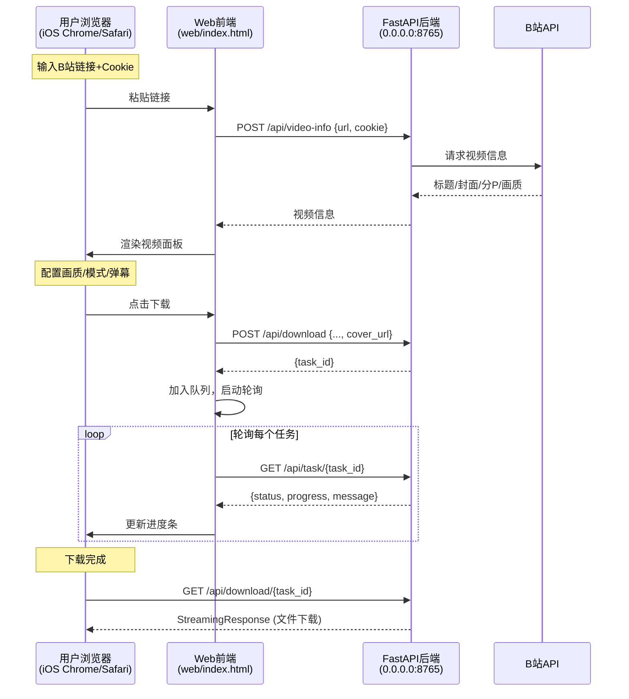

## 用户需求

为现有 B站视频下载器创建一个 Web 前端界面，使 iOS 端 Chrome/Safari 浏览器也能直接访问和使用下载功能。当前项目仅有 Chrome Extension 前端，iOS 浏览器不支持安装扩展。

## 产品概述

在现有后端服务基础上，新增一个独立的单页 Web 应用（SPA），通过浏览器直接访问 `http://127.0.0.1:8765` 即可使用完整的下载功能。保留原有 Chrome Extension 不受影响。

## 核心功能

- **视频信息获取**：用户输入 B站视频链接，前端直接调用 `/api/video-info` 获取标题、封面、UP主、分P列表、画质列表
- **Cookie 输入**：提供 Cookie 输入框（可折叠），用户从 B站页面手动复制 Cookie 后粘贴（提示如何获取）
- **下载配置**：选择分P、画质、下载模式（视频/音频）、音频格式、弹幕选项，手动输入保存路径
- **下载队列**：复用后端已有队列 API，前端展示多个任务的独立进度条和状态
- **文件下载**：下载完成后，通过 `/api/download/{task_id}` StreamingResponse 触发浏览器下载
- **响应式设计**：适配桌面端（宽屏布局）和移动端（iOS Safari/Chrome，375px-414px 宽度），暗色主题 + B站粉主色调
- **局域网访问**：服务绑定 `0.0.0.0` 使同局域网下的 iOS 设备可通过电脑 IP 访问

## 与扩展版差异

- 扩展版自动从 B站页面提取 BV号和 Cookie → Web版需用户手动输入链接和 Cookie
- 扩展版通过 `chrome.storage` 持久化设置 → Web版用 `localStorage`
- 扩展版通过 tkinter 选择文件夹 → Web版用文本输入框
- 扩展版通过系统资源管理器打开文件夹 → Web版无此功能（改为提供路径复制）
- 扩展版通过 background.js 代理请求 → Web版直接 fetch 后端 API

## 技术栈

- **前端**：纯 HTML + Vanilla JavaScript + CSS（零依赖，与现有 popup 保持一致的风格）
- **后端**：FastAPI + Uvicorn（已有，仅新增静态文件服务 + 绑定地址改为 `0.0.0.0`）
- **存储**：localStorage（替代扩展版的 chrome.storage）

## 实现方案

### 核心策略：最小化改动，最大化复用

**后端改动极小**（仅 2 处）：

1. 添加 `StaticFiles` 挂载来提供前端 HTML/JS/CSS
2. 将绑定地址从 `127.0.0.1` 改为 `0.0.0.0`（支持局域网访问）

**前端新建 3 个文件**（完全独立于 extension/ 目录）：

1. `web/index.html` — 单页应用 HTML 结构
2. `web/app.js` — 完整交互逻辑（直接 fetch 后端 API，无需 background.js 代理）
3. `web/style.css` — 响应式样式（移动端优先）

### 数据流



### 关键实现细节

#### 1. 后端改动（server.py）

```python
from fastapi.staticfiles import StaticFiles
import pathlib

# 挂载 Web 前端静态文件
web_dir = pathlib.Path(__file__).parent.parent / "web"
web_dir.mkdir(parents=True, exist_ok=True)
app.mount("/web", StaticFiles(directory=str(web_dir), html=True), name="web")

# 修改启动绑定地址
uvicorn.run("server:app", host="0.0.0.0", port=8765, reload=False)
```

同时保留 `GET /` 返回 JSON 的行为不变，让 `http://127.0.0.1:8765/web/` 访问前端界面。

#### 2. 前端核心逻辑（app.js）

- **视频信息获取**：用户输入链接 → 正则提取 BV号 → 直接 `fetch('/api/video-info')` → 渲染 UI
- **Cookie 获取指引**：显示步骤说明（F12 → Application → Cookies → 复制所有 Cookie 值拼接）
- **下载流程**：`fetch('/api/download')` → 获取 task_id → `setInterval` 轮询 `/api/task/{id}` → 更新队列 DOM
- **文件下载触发**：任务完成后，使用 `<a download>` 标签或 `window.open` 触发 `/api/download/{task_id}`
- **localStorage 持久化**：保存 Cookie、下载路径、下载模式、音频格式、弹幕设置

#### 3. 响应式设计策略

- 使用 CSS 变量统一管理颜色（与扩展版一致）
- 移动端（<768px）：单列布局，全宽输入框，队列项紧凑排列
- 桌面端（>=768px）：最大宽度 600px 居中，两列布局（封面+信息并排）
- 触摸友好：按钮最小 44px 高度，间距充足

### 性能与兼容性

- **零依赖**：不引入任何 JS/CSS 框架，纯原生实现，加载极快
- **iOS Safari 兼容**：使用 `-webkit-` 前缀处理弹性滚动、安全区域适配
- **轮询间隔**：1s/次，单次 API 调用 <10ms（仅查内存 dict）
- **DOM 更新**：增量更新队列项，不整体重渲染

## 目录结构

```
G:\bilibili-downloader\
├── backend\
│   └── server.py              # [MODIFY] 新增 StaticFiles 挂载 + host 改为 0.0.0.0
├── web\                        # [NEW] Web 前端目录（独立于 extension/）
│   ├── index.html              # [NEW] 单页应用 HTML，包含视频面板、下载队列、Cookie 输入区
│   ├── app.js                  # [NEW] 完整交互逻辑：视频信息获取、下载队列、localStorage 持久化
│   └── style.css               # [NEW] 响应式样式：移动端优先，暗色主题，B站粉主色调
└── 启动服务.bat                # [MODIFY] 更新提示信息，加入 Web 访问地址
```

## 设计风格

采用与现有 Chrome Extension 一致的暗色科幻风格，深色背景 (#1a1a2e) 搭配 B站粉色 (#FB7299) 渐变作为主色调。移动端优先设计，在 iOS Safari/Chrome 上呈现为原生应用般的体验。

## 页面规划

仅一个单页面应用，通过面板切换实现不同功能区域。

### 页面区块（从上到下）

**1. 顶部导航栏**

- 粉红渐变背景 (#FB7299 → #ff6b9d)，左侧显示"B站视频下载"logo，右侧显示版本号
- 固定在顶部，移动端和桌面端一致

**2. 链接输入区**

- 输入框 + 获取信息按钮，输入 B站视频链接（支持完整链接或纯 BV号）
- Cookie 输入区（可折叠），展开后显示大文本框 + 获取 Cookie 指引（三步图文说明）
- 桌面端：输入框和按钮水平排列；移动端：垂直排列，全宽

**3. 视频信息面板**

- 视频封面缩略图 + 标题/UP主/时长信息
- 分P选择下拉框（多P视频时显示）
- 画质选择下拉框（全部12种画质，不可用灰显）
- 下载模式切换（视频+音频 / 仅音频）
- 音频格式选择（仅音频模式时显示：MP3/FLAC/Hi-Res）
- 弹幕选项（复选框 + 软封装/硬烧录模式切换）
- 保存路径输入框
- 服务状态指示灯
- 下载按钮（粉红渐变，全宽）

**4. 下载队列面板**

- 任务列表（每个任务一张卡片）
- 卡片内容：左侧状态图标(⏳/✅/❌) + 标题（单行截断）+ 进度条 + 百分比
- 完成的任务显示"下载文件"按钮
- 底部"返回视频页面"按钮
- 移动端：卡片更紧凑，进度条高度 4px；桌面端：卡片 padding 稍大

**5. 底部提示栏**

- 灰色文字提示"确保下载服务已启动 (端口 8765)"
- 局域网访问提示（显示本机 IP）

## 移动端适配

- 安全区域适配：`padding: env(safe-area-inset-top) env(safe-area-inset-right) env(safe-area-inset-bottom) env(safe-area-inset-left)`
- 输入框和按钮最小触摸目标 44px
- iOS 弹性滚动：`-webkit-overflow-scrolling: touch`
- 禁止 iOS 缩放：`user-scalable=no`（保留双指缩放能力）

## Agent Extensions

### SubAgent

- **code-explorer**
- 目的：已用于全面探索项目结构和所有关键文件
- 预期结果：已获取完整的项目架构、API 接口、前端代码和样式模式